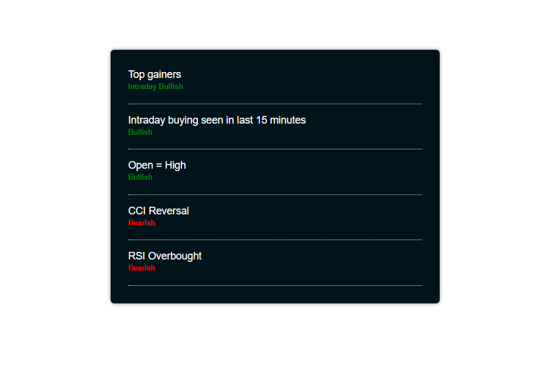

# Stock Scan Parser
Project Built in ReactJS.

## Showcase

<table align="center">
    <tr>
        <td>
            <a href="https://Virajj28.github.io/stock-scan-parser">
                

                    
                    
Home Page

                

            </a>
        </td>
    </tr>
    </table>

## Available Scripts

In the project directory, you can run:

### `npm start`

Runs the app in the development mode.\
Open [http://localhost:3000](http://localhost:3000) to view it in your browser.

The page will reload when you make changes.
