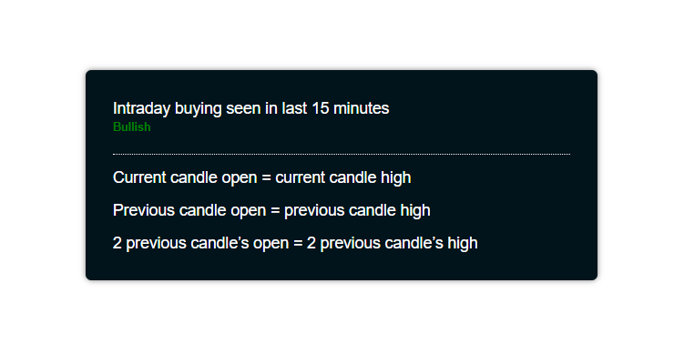

# Stock Scan Parser
Project Built in ReactJS.

## Showcase

<table align="center">
    <tr>
        <td>
            <a href="https://github.com/Virajj28/Stock-Scan-Parser/blob/main/readme/homestock.png">
                

                    
                    
Stock Data Page

                

            </a>
        </td>
        <td>
            <a href="https://github.com/Virajj28/Stock-Scan-Parser/blob/main/readme/criteria.png">
                

                    
                    
Stock Data Criteria Page

                

            </a>
        </td>
    </tr>
    </table>

## Available Scripts

In the project directory, you can run:

### `npm start`

Runs the app in the development mode.\
Open [http://localhost:3000](http://localhost:3000) to view it in your browser.

The page will reload when you make changes.
